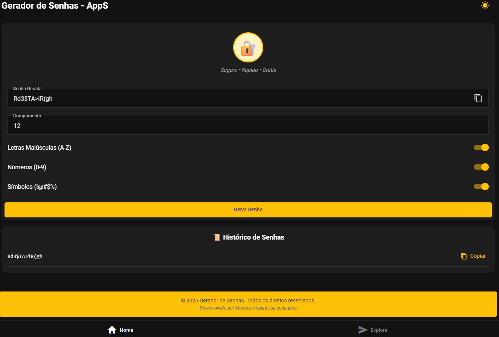

🔐 SafeShield Mobile – App Expo

Bem-vindo ao seu projeto criado com Expo usando create-expo-app. Este app é um gerador de senhas simples e funcional, ideal para aprender e praticar desenvolvimento mobile com React Native.

🚀 Primeiros Passos
1️⃣ Instalar dependências
bash
npm install
2️⃣ Iniciar o app
bash
npx expo start
Você poderá abrir o app em:

📱 Build de desenvolvimento

🤖 Emulador Android

🍏 Simulador iOS

🧪 Expo Go – ambiente limitado para testes rápidos

🧭 Estrutura do Projeto
Os arquivos principais estão no diretório app

Este projeto utiliza roteamento baseado em arquivos

Componentes reutilizáveis estão em components

Imagens e assets estão em assets/images

🔐 SafeShield Mobile – App Expo

Bem-vindo ao projeto criado com Expo usando create-expo-app. 

Este app é um gerador de senhas simples e funcional, ideal para aprender e praticar desenvolvimento mobile com React Native.

🚀 Primeiros Passos

1️⃣ Instalar dependências
bash
npm install

2️⃣ Iniciar o app
bash
npx expo start
Você poderá abrir o app em:

📱 Build de desenvolvimento

🤖 Emulador Android

🍏 Simulador iOS

🧪 Expo Go – ambiente limitado para testes rápidos

🧭 Estrutura do Projeto
Os arquivos principais estão no diretório app

Este projeto utiliza roteamento baseado em arquivos

Componentes reutilizáveis estão em components

Imagens e assets estão em assets/images

📚 Recursos Úteis
📖 Documentação do Expo

🧑‍🏫 Tutorial passo a passo

💬 Comunidade no Discord

🛠️ Expo no GitHub

💡 Sobre o Projeto
Este app foi criado para gerar senhas aleatórias com diferentes níveis de complexidade. Ideal para quem está começando com React Native e quer entender como lidar com componentes, hooks e estilização.

## 🌐 Acesse o app online

Você pode testar o app diretamente no navegador:

👉 [Abrir o Gerador de Senhas](https://Manoelah20.github.io/safeshield-mobile-App)

## 🌐 Acesse o app online

Você pode testar o app diretamente no navegador:

👉 [Abrir o SafeShield Mobile](https://github.com/Manoelah20/safeshield-mobile-App)

